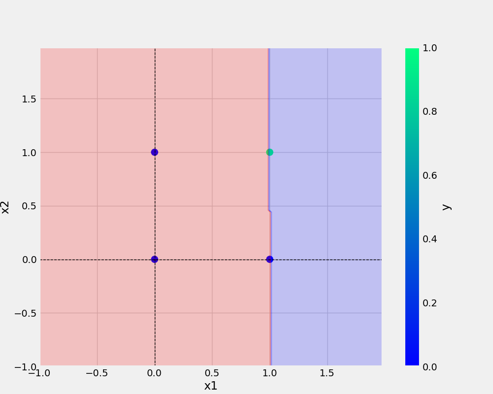

# Perceptron
my first perceptron project 


# Command use in this project 
1. conda env list 
2. conda create -n perceptron python=3.7 
3. conda activate perceptron 
4. pip install -r requirements.txt 
5. git add . 
6. git commit -m "updated" 
7. git puch origin main 
8. history 

## To check different version of the code 
-> git checkout versioncode 

## To check back to the main 
-> git checkout main 

## To make directory 
-> mkdir pouru

## To make new file 
-> touch src/utils/callbacks.py

## To add url -
[git handbook](https://github.com/git-guides)

## Add image-


## To add python code 
```python 
def main(data,eta,epochs,modelName,plotName):
    df=pd.DataFrame(data)
    print(df)

    x,y=prepare_data(df)

    model = Perceptron(eta=ETA,epochs=EPOCHS)
    model.fit(x,y)
    _ = model.total_loss()

    save_model(model,filename=modelName)
    save_plot(df,plotName,model)
```

## Dataset
x1 | x2 | y
-|-|-
0|0|0
0|1|0
1|0|0
1|1|1


