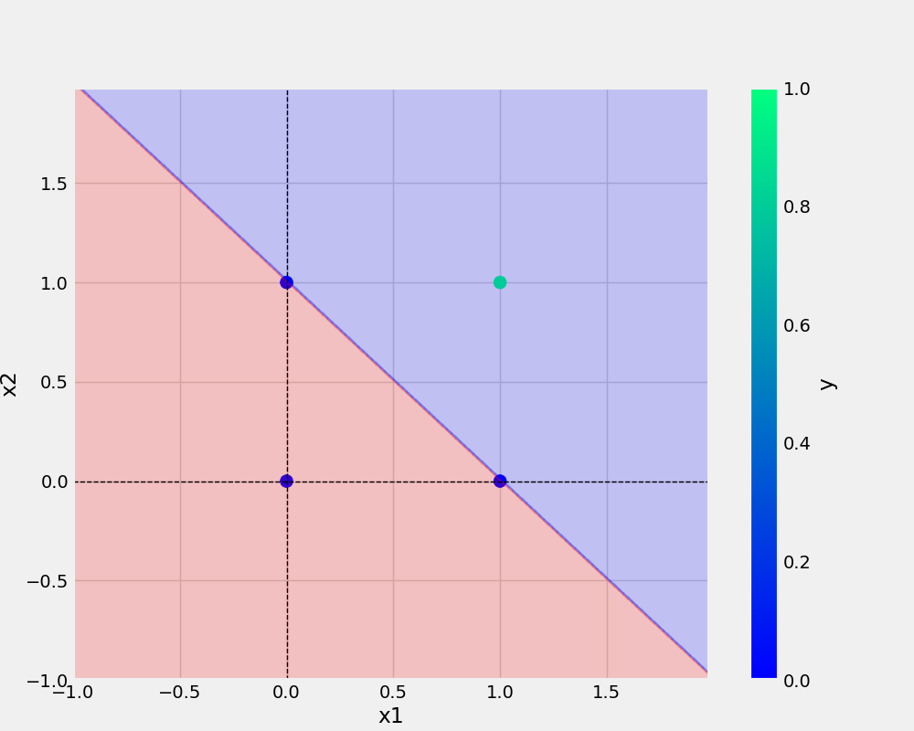

# Perceptron
my first perceptron project 

# Command use in this project 
1. conda env list 
2. conda create -n perceptron python=3.7 
3. conda activate perceptron 
4. pip install -r requirements.txt 
5. git add . 
6. git commit -m "updated" 
7. git puch origin main 
8. history 

## To check different version of the code 
-> git checkout versioncode 

## To check back to the main 
-> git checkout main 

## To add url -
[git handbook](https://github.com/git-guides)

## Add image-

